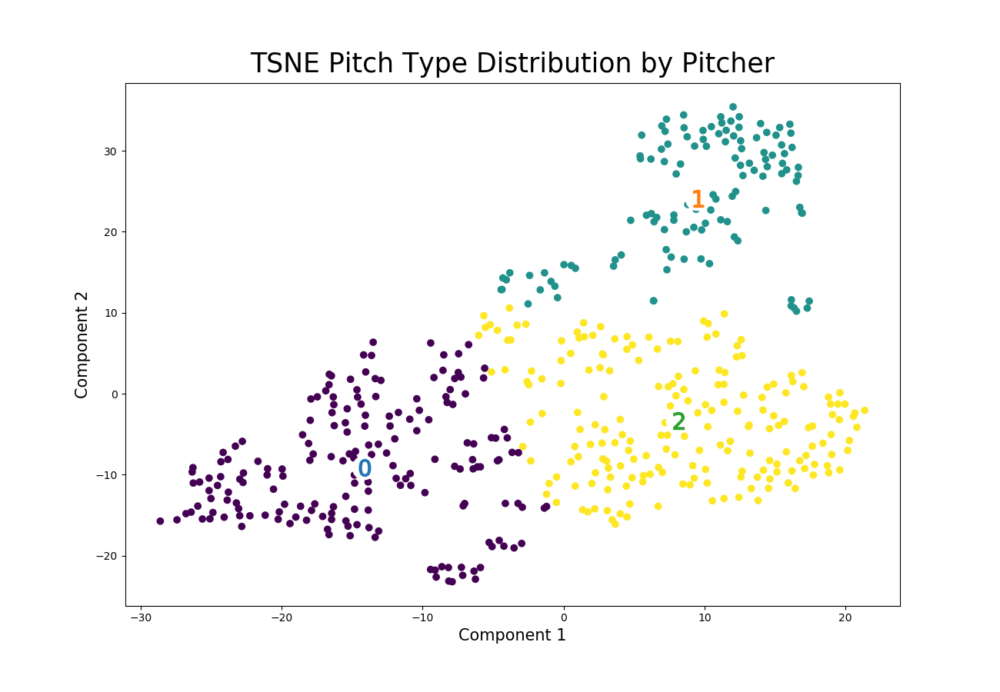
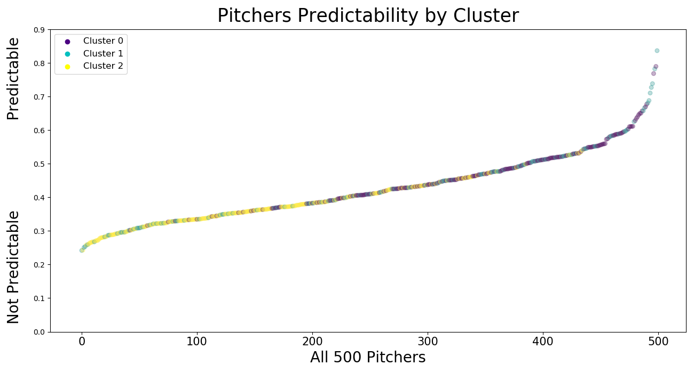

# Is your Pitcher Predictable?

You could say pitching is one of the most important aspects of Baseball. They are involved in every defensive play, and based on ERA their performance makes a big difference in the flow of a game. But how can you tell how effective a pitcher is? 

This study will take a look at each pitcher in Major League Baseball and attempt to predict whether or not they are predictable. 
Using Pitch data from the 2015-2018 season we will predict the next pitch for each pitcher and depending on how well we are able to do so, we will determine how effective each pitcher is. 

### Table of Contents

1. [Goals](#goals)
2. [Pipeline](#pip)
3. [Analysis](#ana)
4. [Models](#model)
5. [Conclusion](#conclusion)
6. [Contact Information](#contact)

## 1. Goals

One of the biggest goals of this project was to classify if a pitcher is predictable or not, and come up with clear answers to interpret that "predicatability" aspect of each pitcher. This was really difficult because a first I did not have much to go on in terms of predictability and what makes a pitcher predictable or not. Lets take a look at the pipeline to see the steps I took to come up with this metric. 

## 2. Pipeline

The data preprocessing dealt a lot with imputing missing values, finding stats for each pitcher, and lots of visualization for understanding. After that I took a Supervised Learning route and found accuracy scores for each pitcher, and an unsupervised learning route that found relationships between pitchers based on the distribution of pitches that they continually throw. In the end I combined these two findings for a very interesting look at the predictability of each pitch.

Due to a lot of unknown at the beginning of this project, the pipeline can look somewhat intimidating. Here is the general overview about what I did and why:

The main goal that I set out was to find a relationship between a pitcher’s performance and how predictable their pitches are. Using Supervised Learning I used a multi-classification model to classify the pitch type on each given pitch using, the count, runners on base, the batter, and several other features for each individual pitcher. This model provided an accuracy score for each pitcher that threw over 2,000 pitches which we can interpret as their “predictability”. I also used dimensionality reduction techniques to perform unsupervised learning Clustering on each pitcher and their new “features” that can be interpreted as a combination of the percentages of each pitch type that they threw. By clustering each pitcher using Kmeans with 3 clusters, we were able to find impressive results between their individual “predictability” and their distribution of pitches that they throw. 

## 3. Analysis

This Project involved a lot of EDA. This dataset was provided on Kaggle and contained Major League Pitching data from 2015-2018. The data was contained into separate csv's:

| CSV's | Contents | Number of Rows | Number of Columns |
|--------------------------|------------------------------|-------------|----------|
|`atbats.csv`| count, outcome, batter name, pitcher name, inning, etc. of each atbat|740,389 | 11|
|`player_names.csv`|first name, last name|2,218 | 3|
|`games.csv`| team, location, weather, score, etc. for each game|9,718|17|
|`pitches.csv`| speed, location, live game stats, etc. for every pitch thrown|2,867,154 |40|
|`ejections.csv`| name, time, game, etc. of every ejection|761 |10|

## 4. Modeling

The interpretation of these pitchers predictability came from two different types of modeling, Supervised Learning, and Unsupervised learning. 

#### **Supervised Learning**
The first step was to run an out of the box Decision Tree Classifier on each pitcher and all of their pitches to predict the pitch type in each scenario. The Decision Tree Classification model was chosen because it performed the best in the shortest amount of time. 

#### **Unsupervised Learning**
After lots of eda and cleaning I was able to get a vector for each pitcher that describes the disribution of pitches that they throw. For example here is what Justin Verlander's vector would look like. 

|name|AB|CH|CU|EP|FA|FC|FF|FO|FS|FT|IN|KC|KN|SC|SI|SL|
|----|------|-----|-----|-----|-----|-----|-----|-----|------|-----|-----|----|-----|----|----|
|Justin Verlander|0.0|0.055|0.154|0.0|0.0|0.002|0.587|0.0|0.0|0.001|0.0|0.0|0.0|0.0|0.0|0.199|

The next step was to use a dimensionality reducation technique called t-distributed Stochastic Neighbor Embedding. This technique took all of our pitchers and reduced the 16 different pitches into 2 dimensional data. Here is what the tsne of our 500 pitchers looks like:

Next I used Kmeans Clustering with 3 clusters to try to separate some of these picthers. 

But what do these clusters really mean? Let's take a look. 

This plot contains histograms of all of the pitchers within each cluster. As we can see they all have different "predictability" means. Cluster 0 has the highest mean with a score of 0.48, and then Cluster 1 with a mean of 0.44 and Cluster 2 with a mean of 0.37. 

The next thing I checked was to see what different clusters represented. 

From this plot we can see all of the pitches along the x axis, and each bar corresponding to the percentage that that pitch comes up in each cluster. This is extrememly interesting because now we can visualize what types of pitchers are in each cluster. For example Cluster 0 contains our Four-Seam Fastball Pitchers, and Cluster 1 contains our sinker pitchers. 

How does this all relate to the predictablilty? 

If we look at each of our pitchers predicatability and their cluster, we can see that pitchers in Cluster 2 and Cluster 1 are much less predictable than pitchers in Cluster 0. 

## 5. Conclusions

## 6. Contact Information
